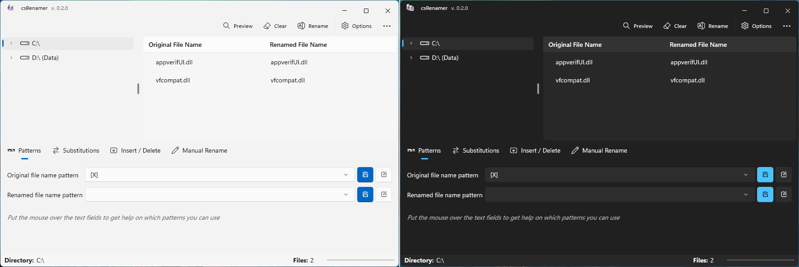

#  csRenamer

**csRenamer** is a cross-platform desktop application for batch renaming files. It provides a flexible graphical interface for renaming files using patterns, substitutions, insertions, deletions, and more — all with instant preview.

This project is a C#/.NET 8.0 reimplementation of [pyRenamer](https://github.com/tfree87/pyRenamer), originally built with WPF and now being migrated to [Avalonia UI](https://avaloniaui.net/) for cross-platform support (Windows, macOS, Linux).



## Features

- Rename files based on patterns (e.g., `1-a.txt` → `a-1.txt` using `{#}-{X}.txt`)
- Regex-based renaming
- Insert characters at specific positions
- Delete characters from specified positions
- Replace matching characters or sequences
- Convert accented characters to plain ones
- Change capitalization (UPPERCASE, lowercase, Title Case)
- Replace or remove dots, dashes, and spaces
- Remove duplicated characters or symbols
- Counter, date, and random placeholders
- Manually rename individual files
- Live preview of all filename changes before applying
- Keep or change file extensions during rename

## Requirements

- [.NET 8.0 SDK](https://dotnet.microsoft.com/en-us/download/dotnet/8.0)

## Build and Run

```bash
# Clone the repository
git clone https://github.com/MawCeron/csRenamer.git
cd csRenamer

# Build the Avalonia (cross-platform) version
dotnet build csRenamer.Avalonia

# Run it
dotnet run --project csRenamer.Avalonia
```

To build the original WPF version (Windows only):

```bash
dotnet build csRenamer
dotnet run --project csRenamer
```

Alternatively, open `csRenamer.sln` in Visual Studio or Rider and press `F5`.

## Project Structure

```
csRenamer/
├── csRenamer/                  # Original WPF project (Windows only)
├── csRenamer.Avalonia/         # Avalonia port (cross-platform)
│   ├── Assets/Icons/           # SVG icons (Lucide + custom)
│   ├── Converters/             # Value converters
│   ├── Resources/              # Colors, Styles (ControlThemes)
│   └── Services/               # Business logic (FileServices, PatternRenamer, etc.)
└── csRenamer.sln
```

## About This Project

csRenamer is a personal reimplementation of the original **pyRenamer** application. It maintains feature parity while using modern .NET and Avalonia UI for a cross-platform experience. Built for users who want to perform complex batch renaming without relying on command-line tools.

## Future Plans

- Music and image file renaming using metadata (ID3, EXIF, etc.)
- Drag-and-drop file support
- Dark mode theme
- Multi-language UI (localization)
