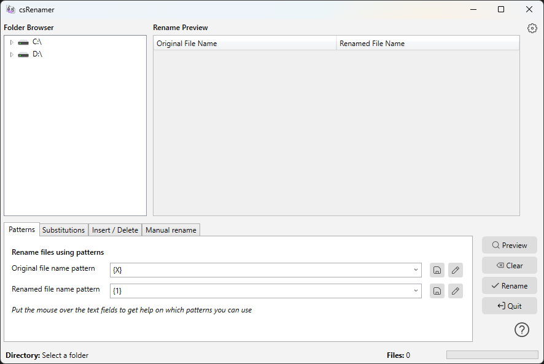

#  csRenamer

**csRenamer** is a Windows desktop application built with **WinUI 3** and **.NET 8.0**, designed for batch renaming files with ease. It provides a flexible and modern graphical interface for renaming files using patterns, substitutions, insertions, deletions, and more — all with instant preview.

This project is a C#/.NET 8.0 reimplementation of [pyRenamer](https://github.com/tfree87/pyRenamer), rebuilt using **Windows App SDK (WinUI 3)** to deliver a native Windows experience with a contemporary UI, proper system integration, and full support for light and dark modes.



---

## Features

csRenamer supports the following features:

- Keep or change file extensions during rename
- Rename files based on patterns  
  (e.g., rename `1-a.txt` → `a-1.txt` using `{#}-{X}.txt`)
- Insert characters at specific positions
- Delete characters from specified positions
- Replace matching characters or sequences
- Convert accented characters to plain ones
- Change capitalization (UPPERCASE, lowercase, Title Case)
- Replace or remove dots, dashes, and spaces
- Remove duplicated characters or symbols
- Manually rename individual files
- Live preview of all filename changes before applying
- Native Windows UI with **automatic light/dark mode support**

---

## Requirements

- Windows 10 (19041) or later
- [.NET 8.0 Runtime](https://dotnet.microsoft.com/en-us/download/dotnet/8.0)
- Optional: Visual Studio 2022+ for development

---

## Build and Run

To build and run csRenamer locally:

```bash
# Clone the repository
git clone https://github.com/yourusername/csRenamer.git
cd csRenamer

# Build the project
dotnet build

# Run the application
dotnet run --project csRenamer
```

Alternatively, open the solution in Visual Studio and press `F5` to run.

> Note: csRenamer is a **packaged WinUI 3 application (MSIX)**.  
> When running via Visual Studio, the app is deployed and launched through Windows, not via a standalone portable `.exe`.

---

## Installer

For regular users, a pre-built Windows installer will be provided using **MSIX packaging** — no manual setup or compilation required.

> The installer will be available on the [Releases](https://github.com/yourusername/csRenamer/releases) page.

You may also download a ZIP containing the packaged binaries if preferred.  
Please note that the .NET 8 runtime must be installed on your system.

---

## About This Project

csRenamer is a personal reimplementation of the original **pyRenamer** application.  
The goal is to maintain feature parity while leveraging **WinUI 3** to provide:

- Native Windows look & feel
- Better DPI and scaling behavior
- Proper dark/light theme integration
- Modern app lifecycle and deployment via MSIX

The application is built for users who want to perform complex batch renaming tasks without relying on command-line tools, while still keeping performance and clarity.

---

## Future Plans

Planned and potential features include:

- Music and image file renaming using metadata (ID3, EXIF, etc.)
- Drag-and-drop file and folder support
- Regex-based renaming rules
- Multi-language UI (localization)
- Additional preview and safety checks before applying changes
